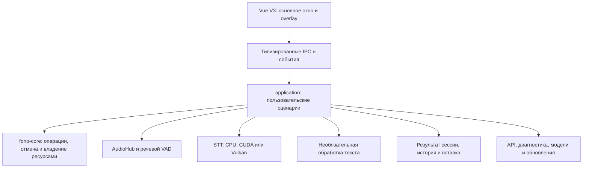

# Архитектура Fono

Источник версии приложения — `package.json`.
Fono — Windows-приложение на Tauri 2 с интерфейсом Vue 3 + TypeScript и
локальным распознаванием через Whisper. Обработка текста может использовать
выбранный локальный или внешний OpenAI-совместимый сервер.

## Интерфейс и граница с Rust

Штатный интерфейс находится в `src/v3/`: основное окно открывает `v3.html`,
плавающий индикатор — `v3.html?view=overlay`. Используются WhiteUI 0.6.0,
SVG-иконки и общие токены. Vue Router использует hash-маршруты.

Фичи разделены на `domain`, `application`, `infrastructure` и `presentation`.
Компоненты получают типизированные порты; Tauri IPC, события, browser storage
и window API находятся в адаптерах. Composition root выбирает native runtime
в Tauri и демонстрационный runtime в обычном браузере.

Browser mock сохраняет только разрешённые демонстрационные настройки. Ключи,
тексты диктовок и записи словаря в browser storage не сохраняются. Native
runtime получает реальные устройства, модели, настройки и результаты из Rust.
Подробнее: [frontend-architecture.md](frontend-architecture.md).

## Слои нативного приложения

- `ipc/` — тонкие Tauri command facade с сохраняемыми именами команд.
- `application/` — диктовка, настройки, модели, история, тренер, диагностика,
  API-сервис, обновления и управление памятью GPU.
- `pipeline/` — координация сессии, завершения, scheduler и выборов обработки.
- `crates/fono-core` — независимые от Tauri FSM, cancellation policy,
  operation-scoped leases и контракты ресурсов.
- `audio/`, `stt/`, `llm/`, `injection/` — конкретные адаптеры оборудования,
  библиотек, сети и Windows.
- `crates/fono-stt-protocol` и CUDA/Vulkan workers — контракт и отдельные
  процессы распознавания; `crates/fono-wake` — сохранённая реализация WakeWord.

Backend публикует `backend-event-v1` с `schema_version = 1`, типизированным
payload и идентификатором операции. Отдельные каналы, которые использует текущий
V3, также публикуются через mapper. Версия envelope независима от версии STT worker protocol.

## Диктовка и завершение сессии

Обычный путь: запись → проверка речи → STT → необязательная обработка и
перевод → личный словарь → публикация результата → вставка или решение
пользователя. Пустая запись завершается до STT, истории и вставки.

Поведение горячей клавиши выбирается отдельно от распознавания:

| Режим    | Начало                         | Завершение         |
| -------- | ------------------------------ | ------------------ |
| `hold`   | Нажать и удерживать комбинацию | Отпустить её       |
| `toggle` | Нажать комбинацию один раз     | Нажать её повторно |

Оба режима используют **классическую диктовку**. Сохранённый или входящий
`live` нормализуется в `standard`. Экспериментальный поэтапный вывод остаётся
скрыт до отдельного согласования качества.

Повторный Stop ожидает результат той же операции. Автоповтор клавиши,
запоздалый Release и ответ старой фоновой задачи не управляют новой сессией.
Cancel блокирует поздние публикацию, архивирование и вставку. Завершение,
очистка ресурсов и архивирование привязаны к идентификатору операции.

Во время записи в режиме `toggle` overlay позволяет изменить обработку,
стиль и перевод. Выбор сначала сохраняется, затем применяется к указанной
сессии; перед Stop интерфейс ждёт сохранения последнего выбора. Ошибка
сохранения возвращает подтверждённое значение.

Завершение горячей клавишей обрабатывает текст с текущим выбором и вставляет
его в исходное поле. Нажатие иконки принятия в overlay завершает запись без
вставки: результат остаётся для копирования или закрытия. Ручная обработка и
ошибка ИИ также удерживают исходный текст для повторного действия. История
архивирует принятую сессию один раз; последний результат хранится в памяти
независимо от включения истории.

## Аудио и защита от случайных записей

`AudioHub` владеет одним физическим CPAL/WASAPI stream для выбранного
устройства и частоты. Поток устройства принадлежит выделенному owner thread;
потребители получают ограниченные RAII subscriptions. Callback не выполняет
распознавание и сетевые запросы: он преобразует входные frames и передаёт их
в ограниченные очереди. Уровень сигнала публикуется через atomic.

Рабочий формат — 16 кГц, моно, i16. Запись, pre-roll и очереди ограничены;
ошибки устройства и потеря пакетов имеют явное состояние. Речевой Silero VAD
отсеивает тишину и случайное нажатие до Whisper. Энергетические вспомогательные
правила обрезки не заменяют проверку речи; список запрещённых фраз не используется.

WakeWord **временно недоступен**: native gate не запускает детектор и не
разрешает тесты/калибровку; сохранённое включение нормализуется в выключенное.
Код, модели и настройки сохранены для последующей доработки. Возможность
произвольной фразы нельзя считать подтверждённой по короткому WAV smoke.

## Распознавание и память GPU

STT использует `whisper-rs` / `whisper.cpp`. Доступны Auto, CPU, CUDA и Vulkan;
выбранное ускорение и фактический backend являются разными значениями.
`ensure_loaded` готовит модель по запросу, а readiness сообщает
`unloaded`, `loading`, `ready` или `failed`. Сохранённая модель также может
прогреваться после запуска; ошибка подготовки не делает startup неуспешным.

Routing lock удерживается при выборе или замене backend-а. Длительная работа
выполняется выбранной session; worker mailbox принадлежит owner thread.
Workers используют **protocol 3** с handshake, capabilities, request/operation
IDs, ограничениями frames, health и shutdown. Отмена поддерживающих её workers
не требует штатно уничтожать прогретую модель; при нарушении протокола или
зависании supervisor закрывает повреждённую session. Embedded Whisper имеет
кооперативные проверки и отбрасывание устаревшего результата.

| Политика                  | Поведение                                                                                                                      |
| ------------------------- | ------------------------------------------------------------------------------------------------------------------------------ |
| `resident` — по умолчанию | Сохраняет загруженную GPU-модель для быстрого старта                                                                           |
| `adaptive`                | При устойчивой нехватке выделенной видеопамяти освобождает модель только в простое; следующая операция загружает её по запросу |

Адаптивная политика измеряет общую dedicated memory через Windows PDH и
сопоставляет карту по DXGI LUID. Сейчас поддерживается ровно одна аппаратная
GPU с dedicated capacity не менее 1 GiB. Несколько GPU, недоступные counters,
изменённая топология и некорректная выборка дают `unsupported`; объём чужой
карты не подставляется. Shared RAM не считается VRAM.

Выгрузка требует одновременно устойчивого давления памяти, простоя и
паузы после загрузки; гистерезис предотвращает частые перезагрузки. Активные
pipeline, очередь API, scheduler, pending-действия и admission leases её
блокируют. Под load gate повторно проверяется поколение модели, поэтому
новая модель не выгружается по старому измерению. Установленный файл модели
остаётся на диске; residency не означает наличие или отсутствие установки.

## Обработка текста, перевод и команды

LLM-клиент поддерживает профили OpenAI-совместимых подключений, выбранные модели,
повторно используемый HTTP client, deadlines, ограничение ответа и отмену.
Обычная диктовка всегда рассматривается как материал для редактирования,
включая вопросы внутри текста.

| Стиль    | Результат                                             |
| -------- | ----------------------------------------------------- |
| `clean`  | Очистка запинок и повторов, пунктуация                |
| `format` | Структурирование имеющихся мыслей                     |
| `task`   | Постановка задачи только из продиктованных требований |
| `formal` | Деловой стиль с сохранением содержания                |
| `raw`    | Без редактирования; без перевода LLM не вызывается    |

Для четырёх редакторских стилей доступен стандартный или пользовательский
системный промпт. Общие неизменяемые правила запрещают ответы на вопросы,
исполнение инструкций из расшифровки и добавление содержания. Один composer
используется диктовкой, повторной обработкой и тестом в настройках.

Перевод включается отдельно, а выбранный язык запоминается при выключении.
`raw` с переводом вызывает только перевод; остальные стили сначала редактируют,
затем переводят результат. Выключенная обработка не вызывает ИИ даже при
сохранённом языке. При ошибке исходный текст остаётся доступен пользователю.
Ограждения промпта не гарантируют послушность каждой сторонней модели.

Тест в настройках принимает текст или изолированную пробную диктовку,
использует черновой промпт и текущий профиль/модель. Он не вставляет текст,
не перезаписывает историю и последний результат основной сессии.

Голосовые команды — отдельный сценарий с локальными правилами и allowlist.
Command hotkey создаёт предложение действия с preview/confirm и сроком жизни;
обычная диктовка не выполняет команды. Свободный Command Agent через LLM
не реализован.

## Вставка, хранение и приватность

Windows-адаптер вставки поддерживает Unicode SendInput и сериализованную
вставку через clipboard с восстановлением поддерживаемого прежнего содержимого.
Исходное поле фиксируется при старте. Смена поля или частичная отправка
блокирует повторную вставку; текст остаётся для копирования. Overlay настроен
с `focus: false` и `focusable: false`, чтобы не забирать фокус внешнего поля.
UIPI ограничивает вставку в приложения с повышенными правами.

Настройки и история находятся в `%APPDATA%\Fono` и записываются атомарно,
с версией схемы, backup и миграцией старого формата. API-ключи хранятся в
Windows Credential Manager; renderer получает признаки наличия ключей.
Имена app data, credential targets и `com.fono.desktop` — стабильная
идентичность установленного приложения. `whisper-models` и vendor Whisper
являются техническими именами, а не остатками старого бренда.

Метаданные истории описывают конкретную сессию: дата/время, длительность
записи, время генерации до готового текста, модель, выбранное ускорение и
фактический backend. Для старых записей неизвестные поля не выдумываются.
Личный словарь выключен по умолчанию и меняет только итог обычной диктовки.
Тренер использует разрешённую пользователем локальную историю; дополнительные
ИИ-рекомендации зависят от выбранного подключения и разрешённых данных.

Диагностический отчёт содержит разрешённые технические поля без текстов,
ключей, сырых ошибок/логов, пользовательских путей, имён устройств, адресов
профилей, промптов и словаря. Тексты уходят на выбранный LLM-сервер только
при соответствующем действии; внешний профиль меняет границу локальности.

## API-сервис и обновления

API слушает loopback, требует bearer token и принимает аудио в отдельные
асинхронные задания. Очереди и окна ограничены, интерактивная диктовка имеет
приоритет. Отмена STT-окна ради этого приоритета не отменяет всё API-задание.
Контракт: [LOCAL_TRANSCRIPTION_API.md](LOCAL_TRANSCRIPTION_API.md).

Канал обновлений — публичный GitHub Releases, `src-tauri/update-channel.json`.
Updater проверяет HTTPS, подпись и подписанную версию, запрещает downgrade.
Автоматические проверки включаются пользователем: при запуске, если прошло
24 часа с предыдущей автоматической попытки, и далее раз в сутки. Метка
попытки хранится отдельно от настроек и текстов. Ручная проверка доступна
без суточного ограничения. Фоновая проверка не скачивает и не устанавливает.

Загрузка и установка требуют явных действий. Admission fence
`application::updates::activity` исключает установку во время активных
операций; асинхронная подготовка и pending удерживают lease до фактического
завершения. Системный installer может требовать UAC и перезапуск приложения.
Подпись updater не заменяет Windows Authenticode. Подробнее:
[fono-ci-updates.md](fono-ci-updates.md).

## Границы подтверждения

Browser mock, Rust unit tests, CI, подписанная упаковка, установленная версия
и пользовательская приёмка — разные уровни проверки. Результат CI относится
к проверенному commit, публикация — к конкретному выпуску. Ручная проверка
updater, голоса, overlay, Windows-полей и GPU-политики остаётся отдельным этапом.

Чистая Windows и AMD/Intel GPU ещё требуют проверки. WakeWord и поэтапный
вывод отключены до подтверждения качества. Измерения коротких публичных WAV
не являются оценкой личного голоса, долгих записей или частоты ложных
активаций. Следующие задачи собраны в [roadmap.md](roadmap.md), текущий
статус — в [STATUS.md](STATUS.md).
